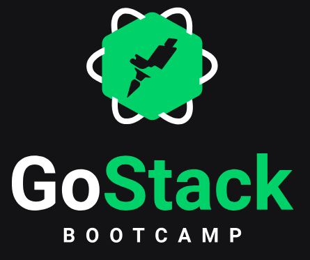

<p align="center">

</p>

# Conceitos das aulas do BootCamp GoStack 11 
## Treinamento imersivo nas tecnologias Nodejs, React e React Native
Repositorio criado para acompanhar as aulas do BootCamp e ter um ponto de referência para futuros desenvolvimentos utilizando as tecnologias envolvidas no treinamento.

### :rocket: Tecnologias
O projeto foi desenvolvido utilizando as seguintes tecnologias:

* [NodeJS](https://nodejs.org/en/)
* [ReactJS](https://pt-br.reactjs.org/)
* [React-Native](https://reactnative.dev/)
* [TypeScript](https://www.typescriptlang.org/)

### :information_source: Como usar
Para clonar e executar essa aplicação, você precisar instalar o [Git](https://git-scm.com/) e o [Yarn](https://yarnpkg.com/).
No seu terminal executar os comandos:

```javascript
#Clone o repositorio
$ git clone https://github.com/igor-fga/conceitos-dev-aulas.git conceitos

#Entre no repositorio
cd conceitos

#Escolha um dos projetos e instale as dependencias
$ yarn install
```
